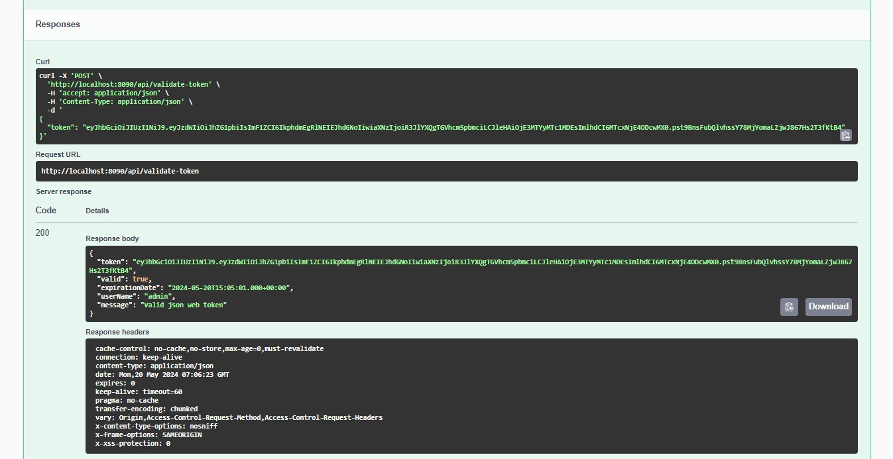
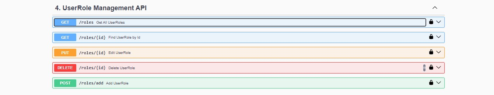
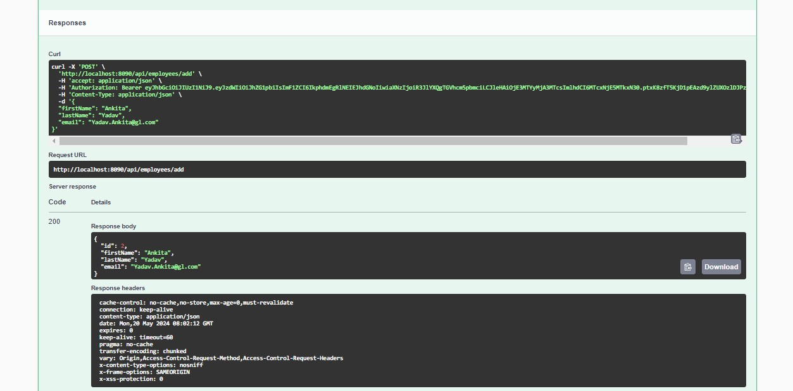
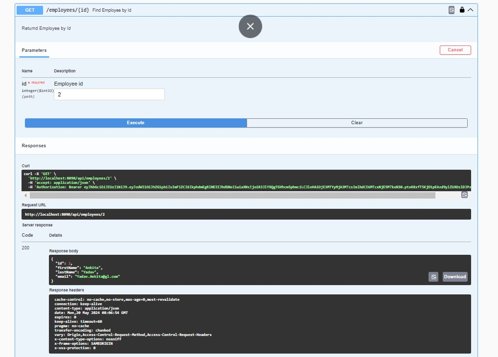
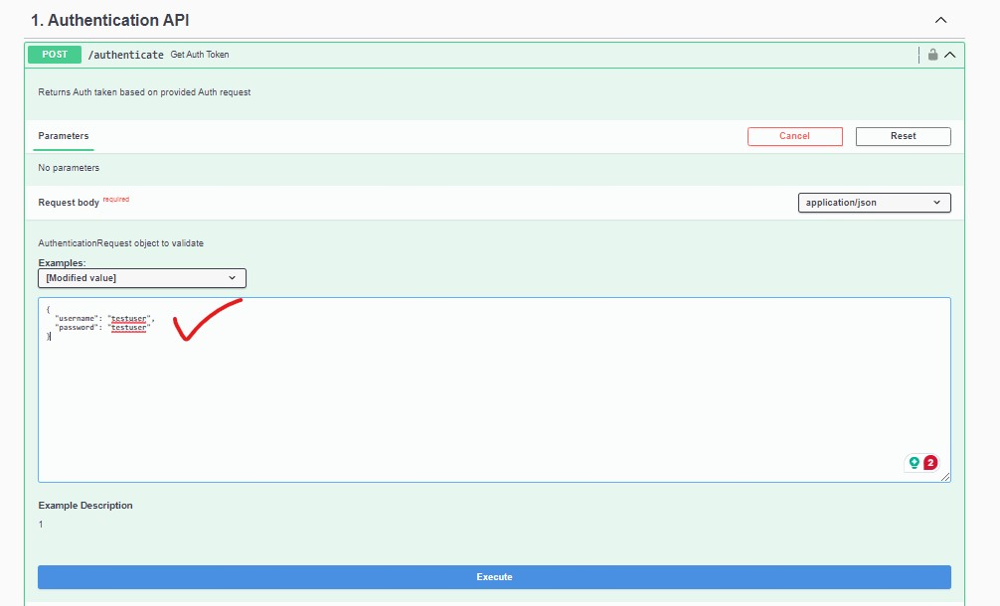
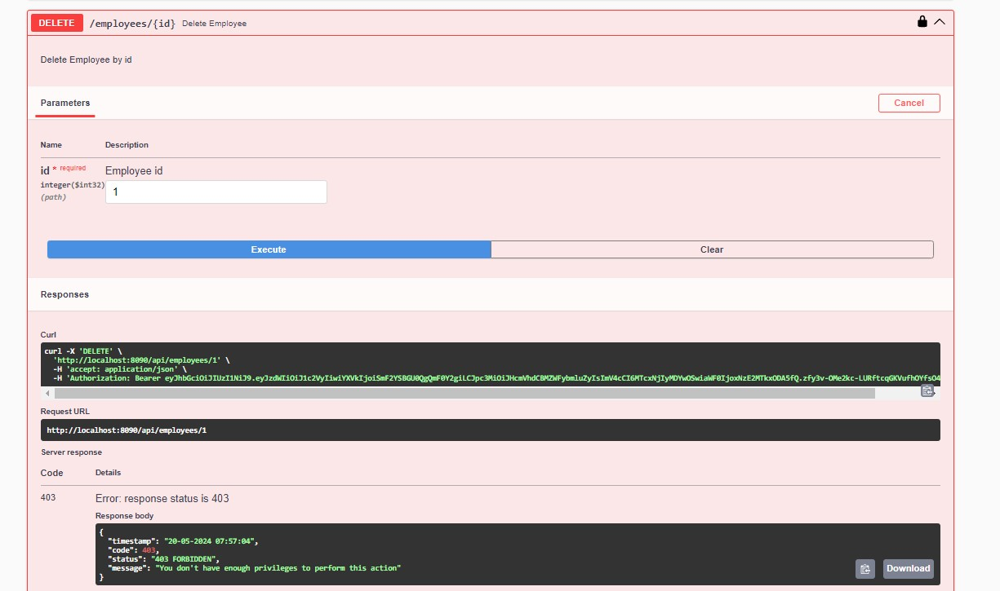

# Employee Management Application with JWT Authentication

## Overview
> The Employee Management Application is designed to manage employee records within an organization. It provides secure access to authorized users based on their roles (Admin or User). JWT is used for authentication, ensuring a secure and efficient login process.

## Features

### Authentication using JWT:

-  Users log in using their credentials (username and password).
-  Upon successful authentication, the server generates a JWT token containing user information and roles.
-  The token is sent to the client and included in subsequent requests for authorization.

### Role-Based Access Control (RBAC):

Two primary roles:
>  Admin: 
 - Has full access to manage employees (add, update, delete).
 
>  User/ Other Roles: 
 - Can view employee details but cannot modify them.
 - RBAC ensures that users can only perform actions allowed by their roles.
 
 
### End Points:

> Authentication:
 - /api/authenticate: Authenticates users and returns a JWT token. [POST]
 - /api/validate-token: Validates the provided Token. [POST]

 
> Role:
 - /api/roles: Get All User Roles. [GET]
 - /api/roles/add: Add new UserRole. [POST]
 - /api/roles/{id}: Find UserRole by Id. [GET]
 - /api/roles/{id}: Update UserRole. [PUT]
 - /api/roles/{id}: Delete UserRole by Id. [DELETE] 
 
> User:
 - /api/users: Get All users. [GET]
 - /api/users/add: Add new User. [POST]
 - /api/users/{id}: Find User by Id. [GET]
 - /api/users/{id}: Update User. [PUT]
 - /api/users/{id}: Delete User by Id. [DELETE] 

 
 
> Employee:
 - /api/employees: Get All Employees. [GET]
 - /api/employees/add: Add new Employee. [POST]
 - /api/employees/{id}: Find Employee by Id. [GET]
 - /api/employees/{id}: Update Employee. [PUT]
 - /api/employees/{id}: Delete Employee by Id. [DELETE]
 - /api/employees/search/{keyword}: Finds all the Employees who have the given Keyword in their FirstName [GET] 
 - /api/employees/sort/order?*direction*: Finds all the Employees and Sort them by give *direction* -- asc or desc [GET] 

  
### Security Flow:

 - User logs in with credentials.
 - Server validates credentials and issues a JWT token.
 - User includes the token in subsequent requests.
 - Server verifies the token and grants access based on roles.

### Benefits

 - Security: JWT ensures secure authentication and authorization.
 - Efficiency: Stateless tokens reduce server-side session management.
 - Scalability: RBAC allows easy addition of new roles and permissions.

### Summary

In summary, the Employee Management Application leverages JWT for secure authentication and RBAC to manage employee records effectively. Admins can add employees, while all users can view employee details.

### Suggested IDE

- Eclipse
- STS
- IntelliJ

## WhiteListed End Points

> Application 
- /api/authenticate
- /api/validate-token
- /api/users/add
- /api/roles/add
- /api/users
- /api/roles
- /api/h2-console/**
- /api/users/accessdenied

> Swagger Related
 - /api/v3/api-docs/**
 - /api/swagger-ui.html
 - /api/swagger-ui/**

## Authenticated Required End Points

> Application 
- /api/employees/search/{keyword} 
- /api/employees/sort 
- /api/employees

## Role Based End Points

> Application 
- /api/users/{id} 
- /api/roles/{id} 
- /api/employees/{id} 
- /api/employees/add

##### Swagger link

 - [Swagger Link](https://http://localhost:8090/api/swagger-ui/index.html) - https://http://localhost:8090/api/swagger-ui/index.html
 
## Gradle Step (if failed load/build the project properly)

## How To Start The application and Test

#### Look for the logs that the application is started or not

#### Note - Application is Running on Port : 8090

#### Once Started Open Swagger

##### link

 - [Swagger Link](https://http://localhost:8090/api/swagger-ui/index.html) - https://http://localhost:8090/api/swagger-ui/index.html

## Project API WalkThrough Using Swagger

### Authentication End Points and Home Page

### Authenticate and Get Token

#### Copy the Token and Add in Swagger Authorize

### Validate Token

### User Role End Points

### Get All User Roles

 
### Add User Role


#### Verify added User Role

### User End Points

### Get All Users

### Add User

#### Verify added User

### Employee End Points

## Role ADMIN Work Flow

#### Set Generated Token In Swagger Authorize Section

### Add Employee

#### Adding One More Employee

#### Adding One More Employee

### Get All Employees and Verify Added Employees

### Get Employee By Id

### Edit Employee By Id

#### Verify Edited Employee

### Find All Employees by Keyword in their First Name

### Find All Employees in Sorted Order based on passed 'order' Parameter

### Delete Employee By Id

#### All Employees Before Deletion

#### Verify Deleted Employee

## Role Other Than "ADMIN" Work Flow ( "USER" )

### Add Employee

#### Error If the Token is not Added to Swagger Authorize Section

#### Added Token to Swagger Authorize Section

#### Not Enough Privileges

### Get All Employees (Works With Role 'User')

### Find All Employees by Keyword in their First Name (Works With Role 'User')

### Find All Employees in Sorted Order based on passed 'order' Parameter (Works With Role 'User')

### Delete Employee, Edit Employee, FInd Employee By Id (Does NOT Works With Role 'User')

#### Example of Delete Employee End Point

## Other Corner Error Cases

### If No JWT Token Is Provided

### If Expired JWT Token Is Provided

